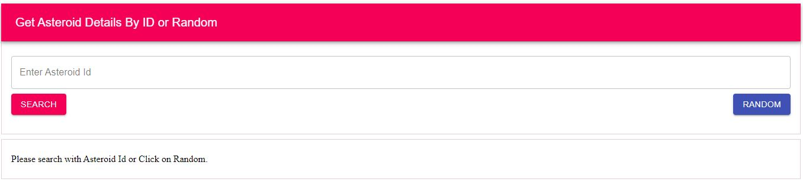
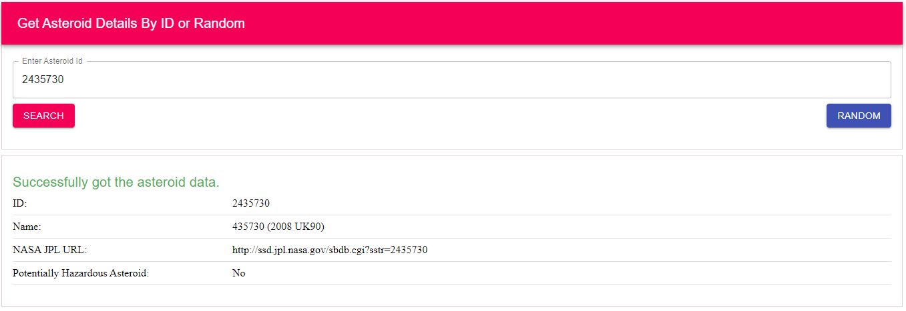
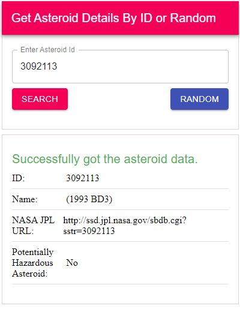

This project was bootstrapped with [Create React App](https://github.com/facebook/create-react-app).

## Application Functionality

Post listing app in react with redux and material UI:

- Setup the application base using `create-react-app` which provide default linting tool(eslint) for code format.
- Integrate the NASA get Asteroid API to search the Asteroid data 
- Click on the random button If you don't know any Asteroid Id
- .env used for the application configuration.
- Test cases are generated using the `react-test-renderer`.

## Available Scripts

### `npm install`

To install packages

In the project directory, you can run:

### `npm start`

Runs the app in the development mode. 
Open [http://localhost:3000](http://localhost:3000) to view it in the browser.

### `npm run build`

Builds the app for production to the `build` folder. 
It correctly bundles React in production mode and optimizes the build for the best performance.

The build is minified and the filenames include the hashes. 
Your app is ready to be deployed!

### Application Snapshot

